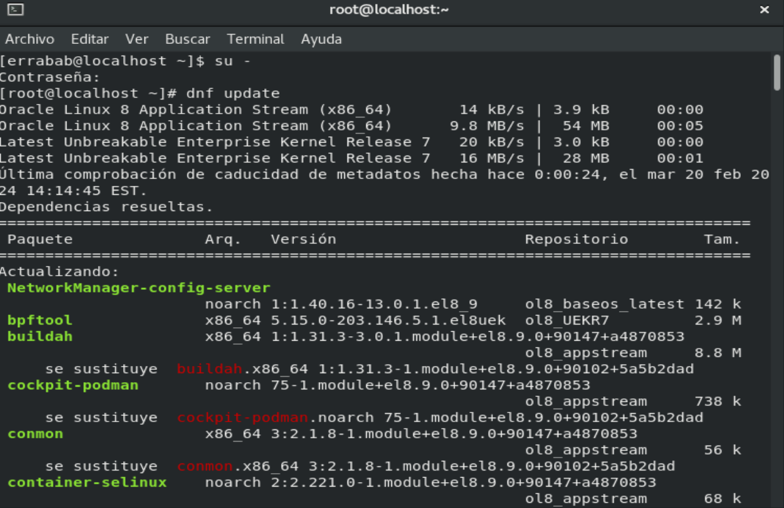
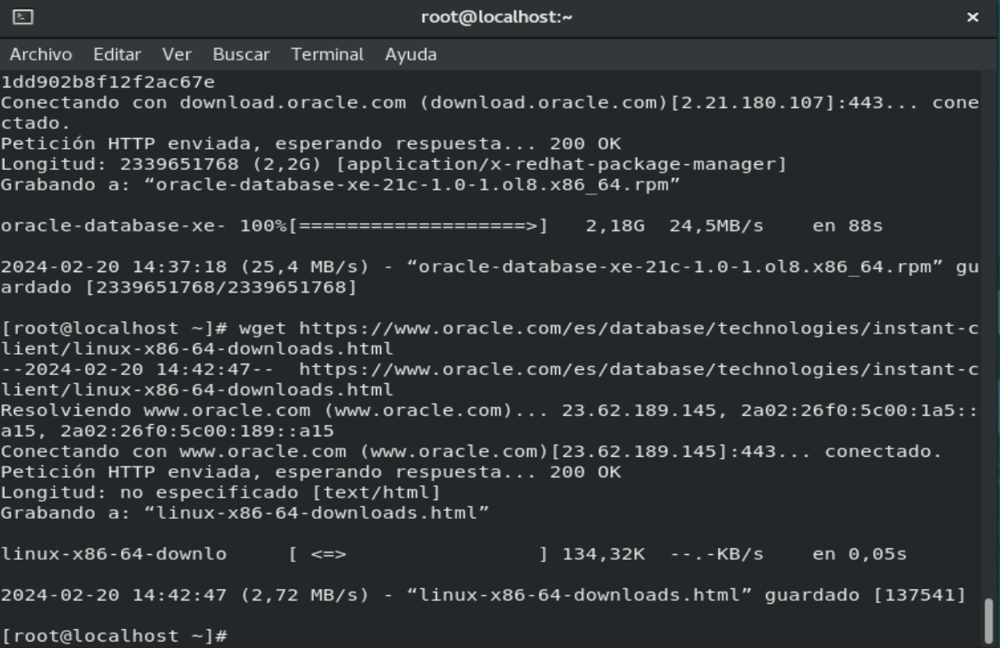

# Database-Installation-Guide

## [Download Oracle on VirtualBox.](Descargarmos.md)
## [Start and configure Oracle](configuracion.md) 
## Steps
After the installations, we have to initiate the installation of the **Oracle DataBase**.
1. Log in as root:
 ` su - `
2. Update the packages:
` dnf update`
Use *dnf* for the new version; if you have an old version, you need to use *yum*.

4. Now we install the Oracle Database from the official website:
   
` wget https://download.oracle.com/otn-pub/otn_software/db-express/oracle-database-xe- 21c-1.0-1.ol8.x86_64.rpm `

5. Install the Oracle Linux client
` wget https://www.oracle.com/es/database/technologies/instant-client/linux-x86-64-
downloads.html `

7. Finally, we only need the IP address of the machine.

The IP is used to connect to the database from other devices with SSH
`ip a`

## Referencias
   * **[Oracle](https://www.oracle.com/es/database/)**
## Autores 
  * Errabab Salec Ahriem 

 

